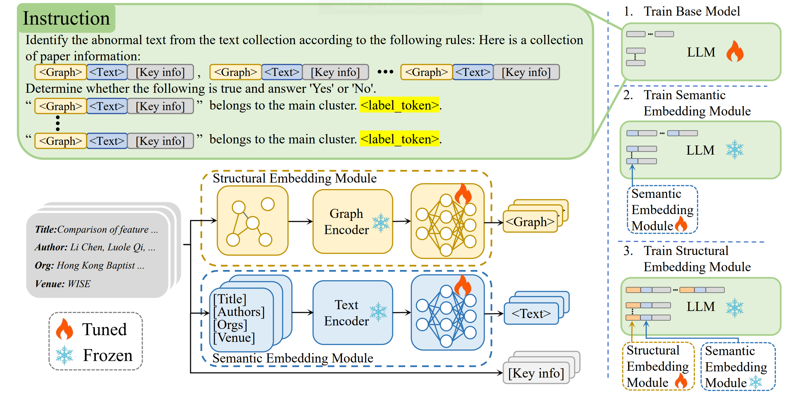

# MIND: Effective Incorrect Assignment Detection through a Multi-Modal Structural-Enhanced Language Model



This project leverages a multi-modal structural-enhanced language model for effective incorrect assignment detection. We supply detailed instructions below for setting up the environment, downloading the necessary models and datasets, running training scripts, and evaluating the models.

<p align="center">
📃 <a href="需要补充arxiv地址" target="_blank"> Paper </a> 
🤖 <a href="https://www.modelscope.cn/models/canalpang/MIND-lora" target="_blank"> Model Parameters </a> 
💻 <a href="https://github.com/pangaass/MIND" target="_blank"> GitHub </a>
</p>

## 🚀 Quick Start

### Dependencies
Build a conda environment using:

```bash

conda create -n mind python==3.10
conda activate mind

# Navigate to the current directory
cd ./MIND

# Install required packages
pip install -r requirements.txt
```

### Datasets

```bash
mkdir data
wget --directory-prefix data https://open-data-set.oss-cn-beijing.aliyuncs.com/oag-benchmark/kddcup-2024/IND-WhoIsWho/IND-WhoIsWho.zip
wget --directory-prefix data https://open-data-set.oss-cn-beijing.aliyuncs.com/oag-benchmark/kddcup-2024/IND-WhoIsWho/IND-test-public.zip
unzip data/IND-WhoIsWho.zip -d data
unzip data/IND-test-public.zip -d data
```

### Required Models and Parameters

download Meta-Llama-3-8B and roberta model from [huggingface](https://huggingface.co/models) or [modelscope](https://www.modelscope.cn/models) 

download and trained checkpoints to params/ from [modelscope](https://www.modelscope.cn/models/canalpang/MIND-lora/summary)

download node embeddings of GCCAD from [here](https://pan.baidu.com/s/1T9fR1dWUdMmf81RHc38dlA?pwd=uqy6)

### Reproduce from checkpoint

```bash 
bash script/reproduce.sh

python auc.py --target output/predict/predict_res.json --src data/IND-test-public/ind_valid_author_ground_truth.json
```

### Train & Evaluate

Config  
change the path of all the config file( in ./configs/llama3/* ):
- ptm_model_path : path to roberta model
- model_name_or_path : path to Meta-Llama-3-8B
- ouput_dir : path to save the output

```bash
bash script/llama3/run_title.sh

# get best eval epoch and edit "lora_ckpt_path" configs/llama3/stage2.json

bash script/llama3/run_title_textemb.sh

# get best eval step and edit "lora_ckpt _path" and "text_proj_ckpt_path" configs/llama3/stage3.json

bash script/llama3/run_title_graphemb.sh

# get best eval step and edit "lora_ckpt_path" , "text_proj_ckpt_path" and "graph_proj_ckpt_path" configs/llama3/title_eval.json

#eval 
bash script/llama3/run_inf.sh
```

## Citation
```
@artical{pang2024mind,
      title={MIND: Effective Incorrect Assignment Detection through a Multi-Modal Structural-Enhanced Language Model}, 
      author={},
      journal={arXiv preprint arXiv:},
      year={2024},
}